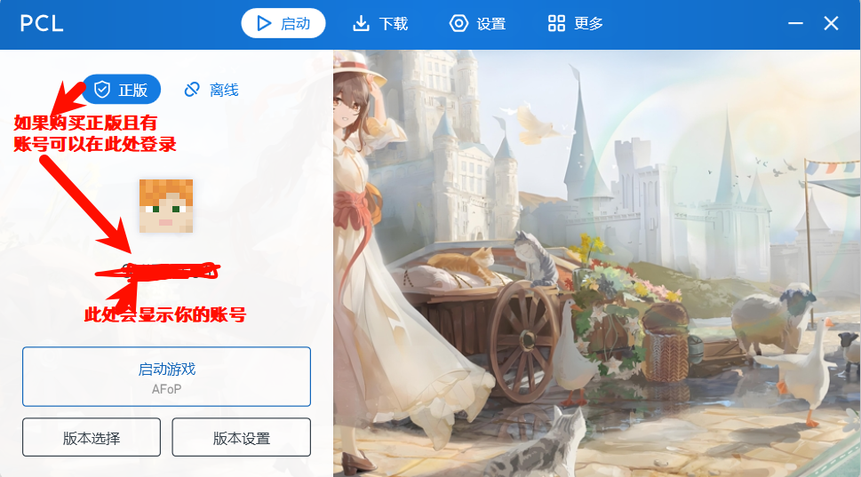
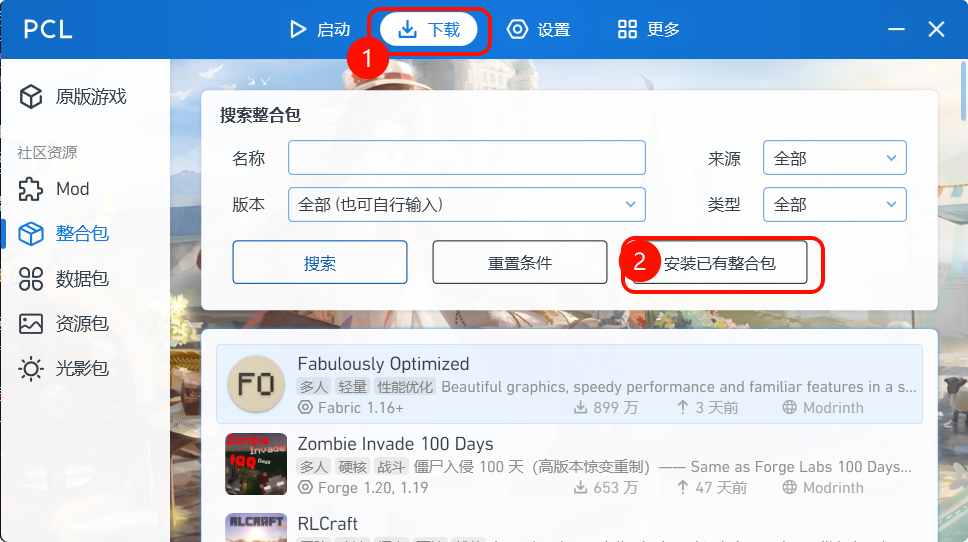
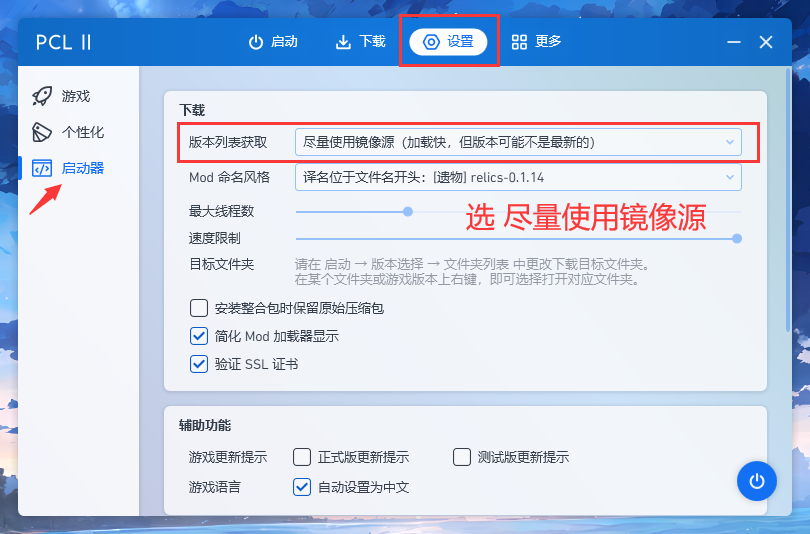
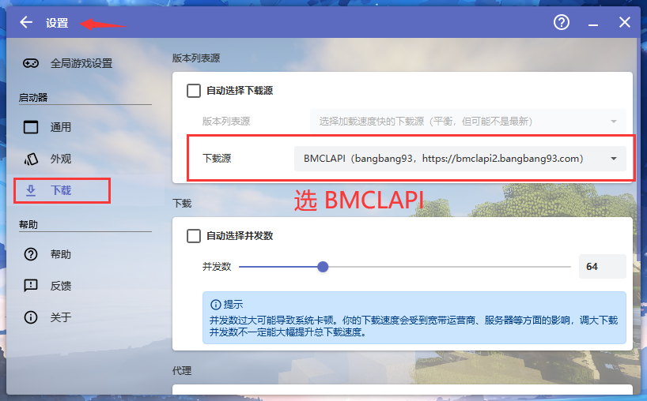

---
### <u><i>感谢耀星及其团队的倾力付出 我为耀星举大旗 喜欢整合包的小伙伴可以去百科和B站支持一波耀星
 </i></u>
---

# AFoP-宁然一隅
> 你是否想过？
偏居一隅之时，习习微风忽而吹开窗，花香与麦香闯进厅堂。
行至窗前，南山良田麦轻扬，北山瓜果自品香，纤纤青竹掠影上，自有良人同心赏。
## 💉***一款休闲养老整合包***

<i>这是一个以森罗物语/农夫乐事系列为核心，Let's do，虚拟人生/凡家物语，节气等为附属的慢节奏休闲整合包。

在这里，你可以悠然自得地种田做饭，也可以看看午后的稻田和夕阳下的村落。要是看到对得上眼的女孩，你能够主动追求，和她结个婚。等哪天觉得生活乏味了，还能出去探索闯荡！你可能会看见群山，小溪，大海亦或是雨林沙漠，说不定还能结识一个小伙伴陪你共同旅行！不过需要注意的是，在这个世界里也是存在着龙和怪物哦，刚到来的你大概并不能和他们抗衡，但是你可以变强啊，你过种的田，做过的菜，吃过的饭，都在不经意间帮你变强！你只需要日常生活，就能提高自身的攻击力和抗性， 等自身成长到一定程度，就能去捕猎巨龙了！除此以外，或许你还会发现新的维度并深入探索。在冒险之余，请不要忘，家依旧是家，觉得累了的话，就回来歇一歇吧~

关键词：休闲，养老，种地，任务引导，自由冒险</i>

## 🎡配置要求
- 推荐 Java17 
- 最低内存分配 4.5G 
- 推荐内存分配 6.0G - 12.0G

## ✨启动器安装
1. 各类网址：
- [耀星官网](https://scarefree.cn/p9/) 
- [MC百科](https://www.minebbs.com/resources/8446/) 
- [b站演示](https://www.bilibili.com/video/BV1hu3tzgE1P/?share_source=copy_web&vd_source=6033adaa90d5b51ef75d809f5668308a)
- [QQ交流群](https://qm.qq.com/q/WXUGJ0VsAY)
1.  推荐启动器：提取码：:spoiler[**0723**]
  - [点我下载PCL](https://www.123865.com/s/iMSmjv-WoLo)
  - [点我下载HMCL](https://www.123865.com/s/iMSmjv-NoLo?pwd=0723#)
2. 安装步骤: 以`PCL`为例
- 整合包下载地址：[AFoP-夸克网盘](https://pan.quark.cn/s/2d9f2c19b095) 
⚠️ 需要本地下载夸克网盘
- 下载好启动器，找到<mark style="background-color:red">非C盘</mark>的任意盘（eg：`D`），新建文件夹（eg：`Minecraft`），文件夹地址为`D:\Minecraft\`
- 打开`Minecraft`文件夹，再次新建`PCL`文件夹
- 双击下载好的安装程序（以`exe`结尾），更改默认安装地址为`D:\Minecraft\PCL`

## 🎉整合包安装

  
启动器安装完毕，桌面双击打开启动器:

1. 简易安装：拖拽你下载好的<mark>【最新】AFoP Continue-x.x.x.zip</mark>到PCL等待安装完毕 
⚠️此方法简单，但是容易报错，报错请看<strong><a id="4-3">PCL安装</a></strong>和<strong><a id="4-4">报错安装</a></strong> 

1. <a id="4.3">PCL安装</a>-如图：

选择你的整合包存放地址<mark style="background:skyblue">D:\Minecraft\PCL\【最新】AFoP Continue-1.6.2.zip</mark> 等待安装完毕 

1. <a id="4.4">报错安装</a>-如图：

4、安装成功后回到<mark>启动</mark>页面，即可开启你的养老生存！！！

  

## 🐻‍❄️整合包更新

更新图集

1. 
2. 
3. 
4. 
5. 
6. 
7. 
8. 
9. 

---
## 🌈友情文章
- [Mizuki-官方文档](https://docs.mizuki.mysqil.com/guide/intro/)

