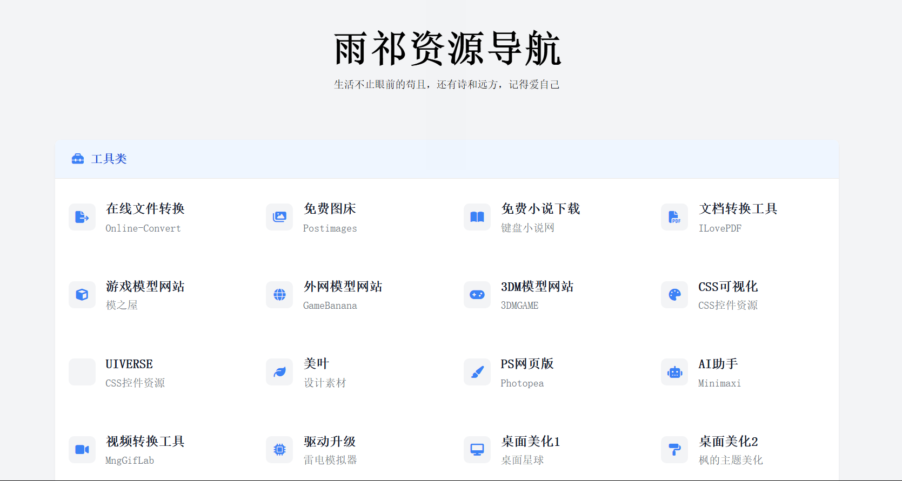

---
### <u><i>生活不止眼前的苟且，还有诗和远方的田野。</i></u>
---

---
## ✨雨祁导航-<a href="https://qitinyu.github.io/YQ-nav/" target="_blank" ><u>访问雨祁导航</u></a>
 - 
 

## 🐻‍❄️好帮手推荐
|类名|站点|备注|
| :-----: | :------: | :------: |
||------------------------工具类--------------------------||
|1.在线文件转换|[online-cover](https://www.online-convert.com/)|-|
|2.免费图床|[postimages](https://postimages.org/)|-|
|3.免费小说下载|[键盘小说网](http://www.janpn.org/)|-|
|4.文档转换工具1|[文档转换](https://www.ilovepdf.com/)|-|
|5.游戏模型网站|[模之屋](https://www.aplaybox.com/)|下载模型需要特定条件|
|6.外网模型网站|[banana](https://gamebanana.com/)|强大是很强大，但是全部英文|
|7.3DM模型网站|[3DMgame](https://mod.3dmgame.com/)|强大无需多言|
|8.CSS控件资源1|[CSS可视化](https://css.bqrdh.com/safety-color)|-|
|9.CSS控件资源2|[UIVERSE](https://uiverse.io/3HugaDa3/sour-bulldog-7)|-|
|10.CSS控件资源3|[美叶](https://www.meiye.art/)|-|
|11.ps网页版|[photopea](https://www.photopea.com/)|-|
|12.ai助手|[minimaxi](https://agent.minimaxi.com/)|-|
|13.视频转换工具|[mnggiflab](https://www.mnggiflab.com/product-mng/gif2webp)|-|
|14.驱动升级|[驱动升级](https://help.ldmnq.com/docs/PQ917d)|-|
|15.桌面美化1|[桌面星球](https://xn--cjr960cm4qezv.com/)|-|
|16.桌面美化2|[枫的主题美化](https://winmoes.com/tools/12948.html)|-|
|17.少儿编程|[SCRSTCH](https://scratch.zhike.in/)|-|
|18.图标库|[Font Awesome.Icons. Easy. Done.](https://fontawesome.com/)|-|
|19.博客数据集成查看|[Umami](https://cloud.umami.is/)|！|
|20.嵌入博客评论系统|[Mongodb](https://cloud.mongodb.com/)|！|
|21.域名申请|[Gname](https://gname.vip/user#/domain_info/ym=yqamm.eu.cc)|！|
||------------------------游戏类--------------------------||
|1.黑暗大全|[原神Wiki](https://wiki.biligame.com/ys/%E9%A6%96%E9%A1%B5)|xxnb|
|2.MC百科|[MC百科](https://www.mcmod.cn/)|国内最大的MC交流论坛|
|3.Minecraft基岩版国内论坛|[苦力怕论坛](https://klpbbs.com/)|-|
|4.MCBBS|[MCBBS](https://www.minebbs.com/)|不容易，经常被打|
|5.在线小游戏|[crazygames](https://www.crazygames.com/)|-|
|6.游戏辅助|[辅助吧](https://www.fuzhu86.com/)|-|
|7.小游戏合集|[资源避难所](https://www.flysheep6.com/)|-|
|8.安卓小游戏推荐|[枫叶应用](https://www.fy6b.com/special/games)|-|
|9.移植游戏大全|[Gamer520](https://www.gamer520.com/)|用别怕，怕别用|
|10.游戏合集|[小叽资源网](https://steamzg.com/)|-|
|11.萌娘百科|[萌娘百科](https://zh.moegirl.org.cn/#/flow)|-|
|12.游戏人物语音合成1|[Mikutools](https://tools.miku.ac/anime_tts/)|-|
|13.游戏人物语音合成2|[acgnS](https://acgn.ttson.cn/)|-|
||------------------------资源类--------------------------||
|1.资源分享1|[狗凯之家](https://www.bygoukai.com/)|资源丰富，下载需特殊条件|
|2.资源分享2|[好用斋](https://haoyongzhai.netlify.app/#/)|-|
|3.资源分享3|[枫叶应用](https://www.fy6b.com/)|-|
|4.资源分享4|[果核剥壳](https://www.ghxi.com/)|-|
|5.资源分享5|[克隆窝](https://www.uy5.net/)|-|
|6.资源分享6|[风雪的博客](https://bk.fookxue.cn//)|-|
|7.资源分享7|[haitangw](https://www.haitangw.cc/)|-|
|8.开源软件平替|[OpenAlternative](https://openalternative.co/)|-|
|9.使用教程|[Gihub Desktop](https://docs.github.com/zh/desktop)|-|
|10.各种常用字体|[字体日记网](https://ziti.xxriji.cn/)|-|
|11.4k壁纸合集|[壁纸汇](https://www.bizhihui.com/)|-|
|12.免费影视剧|[好好看](https://www.hhkan0.com/)|-|
|13.免费音乐下载|[放屁音乐网](https://www.fangpi.net/)|-|
|14.网盘搜索|[混合盘搜索](https://hunhepan.com/search)|-|

---
## 🌈友情文章
- [Mizuki-官方文档](https://docs.mizuki.mysqil.com/guide/intro/)